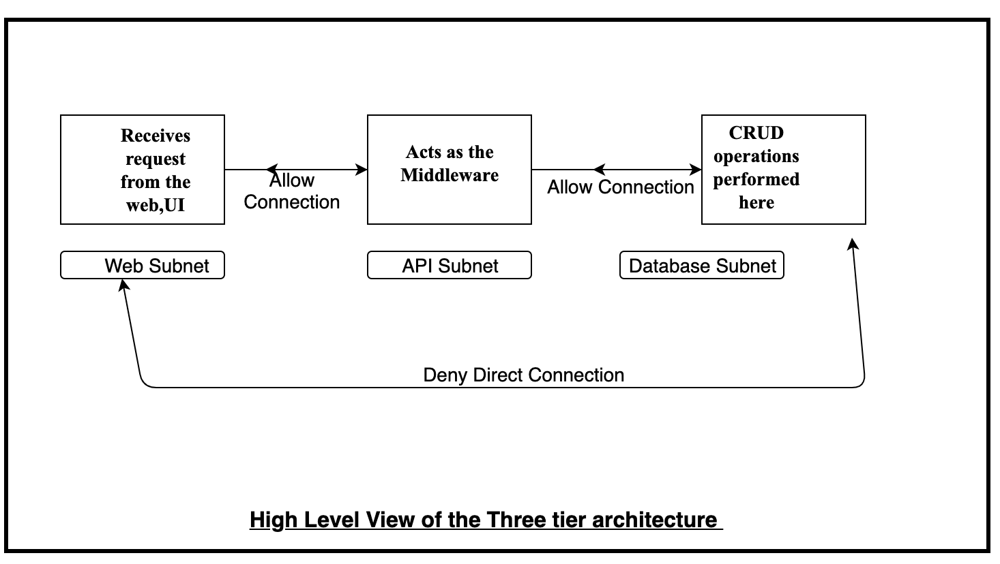
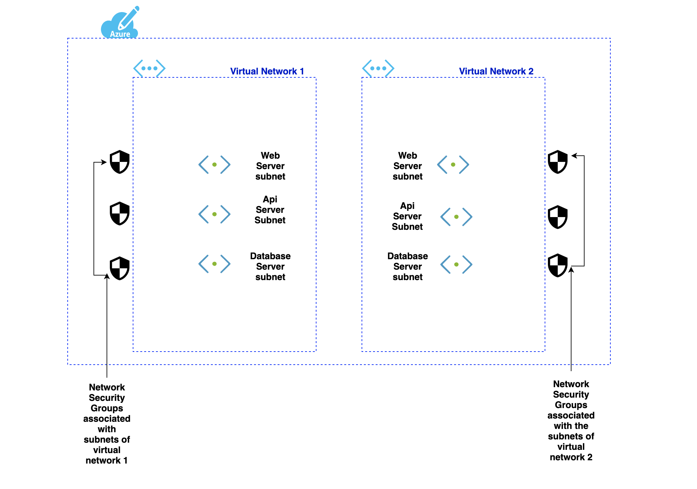

# Deploying the  Three -tier architecure using Pulumi


## THREE TIER ARCHITECTURE
The three   architecture  is a basic model for developing a web database application and communication is done using this 3-level application logic.
The  database tier is  where data gets stored in a database server and is known as fully secure . Various CRUD operations are being performed here. Next is the Api layer inside the Api subnet which provides a communication between the web server and the data base server. Finally there is a web server which aacepts all the internet requests and send requests to the api server.

In this  script  two virtual networks are created  with three subnets each and having three network security groups associated with the subnets.Also  Peering is enabled betwwen the two virtual networks.

Note: Incase of Disaster Recovery we are modifying the database NSG so that the database subnet of virtual network 1 can send its replica to database subnet of virtual network 2 through a specific port.


<p align="center">
</br>
Figure 1.1: High Level View of the Architecture 
</br></br>

Figure 1.2: Detailed Architecture in Azure

</p>

###  Detail of the Architecture implemented
<p allign="center">

Figure 1.3 High Level View of the Architecture </br>
</p>

## Method  to deploy  the javascript file using Pulumi in Azure:

### Installation
 [`Download Pulumi`](https://www.pulumi.com/docs/reference/install/) )

- After Installation, verify pulumi is installed or not by using
```bash
$ pulumi version
```
```bash
$ npm install @pulumi/azure
```

- Create a New Project
```bash
$ pulumi new azure-javascript
```
### Command Line Interface(CLI)

On the  CLI type the command .
```bash
pulumi new
pulumi up
```
## Author
[`Devyanshi Tiwari`](https://github.com/devyanshi-t)<br />

